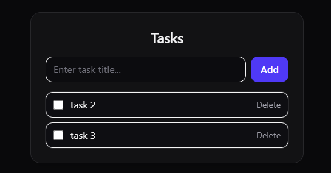

# Task Manager — React + Spring Boot

A simple full-stack task manager built to practice how a React frontend communicates with a Spring Boot REST API.

## ✨ Features
- Add tasks
- Mark tasks as completed
- Delete tasks
- Dark mode UI

## 🛠 Tech Stack

### Frontend
- React
- TypeScript
- Vite
- Tailwind CSS

### Backend
- Spring Boot
- Spring Data JPA
- H2 Database

## 🚀 Getting Started

### Backend
1. cd backend/taskmanager
2. ./mvnw spring-boot:run

### Frontend
1. cd frontend
2. npm install
3. npm run dev
4. Open http://localhost:5173 in your browser.

## Screenshots

## Notes
This project was built as a learning project to understand React state management, useEffect, and interaction with a Spring Boot REST API.
